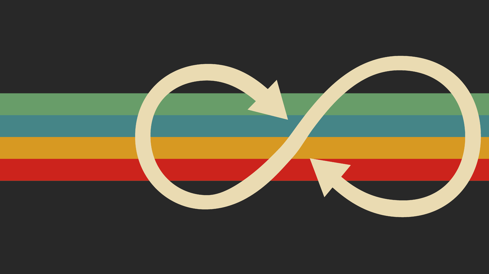
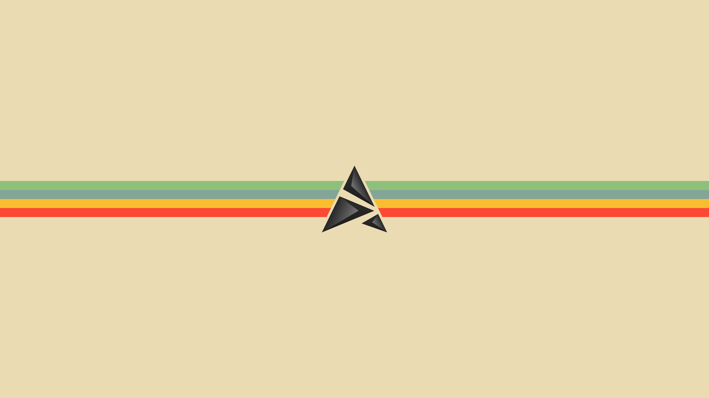
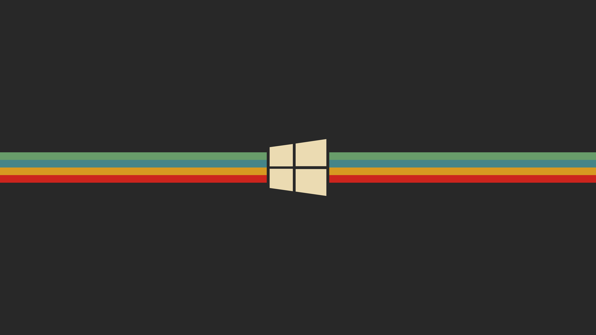
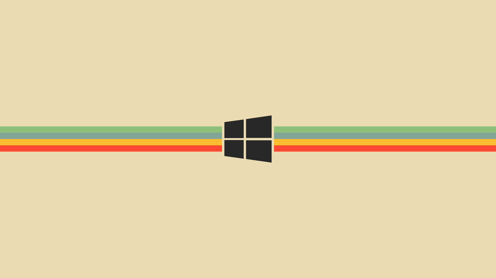

# Gruvbox Theme

Gruvbox is a theme with c pleasing to the eye colors, in a 'retro' design. All colors that are chosen so that nothing overpowers the primary and secondary colors

- [Gruvbox Theme](#gruvbox-theme)
	- [Link`s](#links)
	- [Palette](#palette)
		- [Dark Mode](#dark-mode)
		- [Light Mode](#light-mode)
	- [Wallpapers](#wallpapers)

## Link`s

1. Original Repository(GNOME LINUX): [GitHub](https://google.com)
2. Original page store(GNOME LINUX): [Link Page](https://google.com)
3. Original Repository(Discord):
4. Original Repository(Telegram)
5. Original Repository(Web Themes)
6. Original Theme(Vim): [GitHub](https://github.com/morhetz/gruvbox)
7. Original Theme(VSCode): [VSStore | Material](https://marketplace.visualstudio.com/items?itemName=sainnhe.gruvbox-material) | [VSStore](https://marketplace.visualstudio.com/items?itemName=jdinhlife.gruvbox)

## Palette

### Dark Mode

`#282828 #cc241d #98971a #d79921 #458588 #b16286 #689d6a #a89984 #928374 #fb4931 #b8bb26 #fabd2f #83a598 #d3869b #8ec07c #ebdbb2 #1d2021 #3c3836 #504945 #665c54 #7c6f64 #928374 #d65d0e #32302f #a89984 #bdae93 #d5c4a1 #fbf1c7 #fe8019`

### Light Mode

`#fbf1c7 #cc241d #98971a #d79921 #458588 #b16286 #689d6a #7c6f64 #928374 #9d0006 #79740e #b57614 #076679 #8f3f73 #427b56 #3c3838 #f9f5d7 #fbf1c3 #ebdbb3 #d5c4a2 #bdae92 #928379 #d65d0f #f2e5bd #7c6f67 #665c51 #504948 #fbf1c7 #3c3838 #af3a01`

Thanks morhetz for [images](https://camo.githubusercontent.com/410b3ab80570bcd5b470a08d84f93caa5b4962ccd994ebceeb3d1f78364c2120/687474703a2f2f692e696d6775722e636f6d2f776136363678672e706e67)

## Wallpapers

